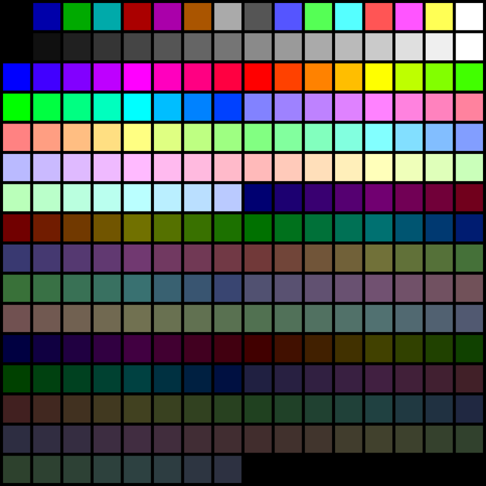
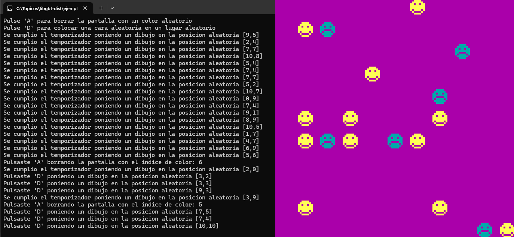

# GBT - Gran Biblioteca de Tópicos

## Guía de inicio

### Descripción
GBT es una biblioteca con posibilidades gráficas para la materia Tópicos de Programación de la carrera Ingeniería en Informática de la Universidad Nacional de La Matanza, realizada con el fin de brindar un entorno de desarrollo más amigable y sencillo, permitiendo así destinar el tiempo de desarrollo a las competencias de la materia.
Contiene una implementación de TDA Vector, temporizadores para manejo de eventos, manejo de teclado, y funciones gráficas básicas. 
### Gráficos
El apartado gráfico emula un funcionamiento similar al de las placas de video VGA, donde la cantidad de colores disponibles al mismo tiempo está vinculada a una paleta de colores indexados. Por ejemplo, GBT incorpora por defecto la paleta de colores de VGA la cual contiene 256 índices de colores.

  

    
## Cómo utilizar

### Instrucciones para el armado del entorno:

En el repositorio podrá encontrar el release correspondiente a cada versión de la biblioteca, con todos los archivos necesarios:

1. Descomprimir con `7-Zip` utilizando la opción `Extract Here`.
2. En Code::Blocks, crear un nuevo proyecto `Console application` para el lenguaje `C` con el título de su preferencia, en el directorio deseado. Copie el contenido del archivo `.zip` anteriormente mencionado en la ruta `lib\GBT_v202*.*C.**\` dentro del directorio de su proyecto.	   
3. Haga clic derecho sobre el nombre del proyecto, pulse `Build options`, estando sobre el `Build target` `Debug` haga click en la solapa `Linker settings`. En `Other linker options` agregue `-lgbt`.
4. Acceda al tab `Search Directories`:
      1. En el tab `Compiler` agregue pulsando el botón `add` la ruta a la carpeta `include/` de la biblioteca.
      2. En el tab `Linker` agregue pulsando el botón `add` la ruta a la carpeta `lib/` de la biblioteca.
    
	Pulse `OK` para guardar los cambios.

5. Para utilizar la biblioteca en los archivos de su proyecto agregue `#include "GBT/gbt.h"` en los archivos `.c` o `.h` que lo requieran.

6. Una vez realizados todos los pasos anteriores ya puede compilar su programa.

7. Para poder ejecutar el programa debe copiar el archivo `gbt.dll` en la ruta donde se generó el resultado de la compilación (la ubicación del archivo `.exe`)

### Documentacion
Podrá encontrar la documentación de las funciones en los headers correspondientes en formato Doxygen.

#### Implementación de referencia
En este repositorio podrá encontrar en la carpeta `ejemplo/` un proyecto de Code::Blocks que utiliza esta biblioteca.

#### Demostración de la biblioteca

En el siguiente video se puede observar una demostración de las capacidades de la biblioteca.

{width=640}

## Aspectos técnicos del proyecto:

#### Desarrollado en:
- IDE: `Code::Blocks 25.03`
- Sistema operativo: `Windows 11 64 bits`

**Nota:** Compatible solo con entornos Windows y arquitectura x86 de 64 bits.